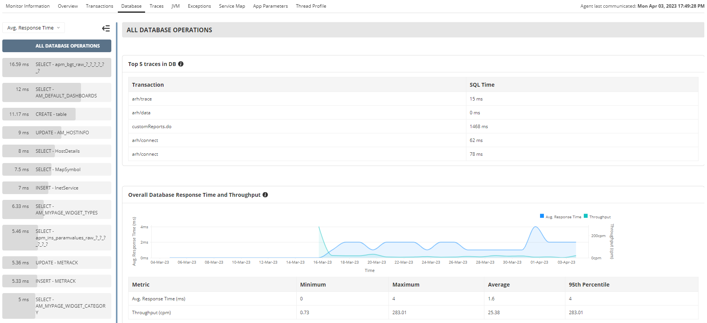

** Proposta Arquitetura**
=======

**Objetivo**
------------

Desenhar um modelo Arquitetural moderno, para ajudar na performaçe e resilência da aplicação Sistema. Diminuir tempo com troubleshooting e facilitar no desenvolido e evoluções de novas integrações.

High-level design e Low Level Design
----------------

High-level: explica a arquitetura que seria usada para desenvolver um sistema . O diagrama de arquitetura fornece uma visão geral de todo um sistema, identificando os principais componentes que seriam desenvolvidos para o produto e suas interfaces. O HLD pode usar termos não técnicos a levemente técnicos que devem ser compreensíveis para os administradores do sistema. Em contraste, o design de baixo nível expõe ainda mais o design lógico detalhado de cada um desses elementos para uso por engenheiros e programadores . A documentação HLD deve abranger a implementação planejada de software e hardware.

Low level design: serve como base para as descrições do modelo de
integração e tecnologias que serão utilizadas durante a fase de
implementação toda comunicação entre os microserviços são HTTPS e suportado versão 1.2 e 1.3 vTLS.

Stack tecnológico
-----------------
- 3Scale API management;
- Node.js;
- Sql Server;
- Jaeger;
- fluentd;
- Grafana;
- Prometheus;
- Pub/Sub;
-----------------------

Proposta Arquitetura Sistema


##### **Planejamento**

1 - Migrar todas as CRONS para serviços.
2 - Criar artefatos para converter a aplicação em container
3 - Testar as aplicações em container local
4 - Criar os Deployment config das aplicações
5 - Configurar Ingress, routes, serviçes, secrets e conifgMaps 
6 - Configurar novo CI/CD para novas aplicações
6.1 - Validar se podemos utilizar a esteira pronta da DL
7 - Testes de performace e acessos ao ambiente Sistema
8 - Configuração de monitoramento da aplicação do Sistema Sistema


##### **Propostas Melhorias Banco de dados**

A primeira proposta para mitigar problemas de lentidão no sistema Sistema para emissão de relatório, seria a sequinte:

Duplicar a instância do banco de dados e utilizar de algumas ferramentas para sink da base dedados de produção para base de dados de relatório:

Podemos utilizar o proprio serviço da azure para  sink dessa base:

Idepedentemente de qual serviço de sink usaremos, o ideal seria que esse sink seja feita de forma automatica, onde a sincronização irá acontecer quando houver mudança de estado nas tables monitoradas.

   - Será necessário tempo para pesquisa para saber como que funciona o sink de serviço da azure.
   - tempo para implementação.

Podemos utilizar também serviços de ELT como o Apache Nifi. Terá um custo de uma maquina linux de 8GB e 2vCPU. Nessa maquina Linux terá que ser instaldo o apache NIFI onde ele irá se connectar nas duas bases de dados e realizar o sink de forma automatica. Essa instalação e configuração do sink é relativamente tranquilo. Os processos para realizar essa intalação/configuração do Apache Nifi a equipe já possui.

Com isso podemos realizar a configuração para que o Sistema Report se connect no banco de dados de relatório, deSistemaogando então a base de dados e produção


O benefício de apatarmos uma base dedados somente para relatório, será a oportunidade de colocamos uma ferramenta exclusiva para relatórios, essa ferramenta se comunicará diretamento com a base de dados de relatório. Com isso toda alteração ou criação nesse relatório não será mais necessário passar por um processo de desenvolvimento. Caso seja necessário será possivél deixar a propria area cliente customizar as criações dos relatórios. Tendo, que claro, a necessidade de-se criar um processo para aprovação do relatório.


Uma outra sugestão para diminuir a latência e tempo para geração do relatório, seria a criação de cache para os dados da consulta. Como isso iria funcionar? Pois bem, iriamos gerar uma carga full de consulta onde teria todos os dados apartir de uma data. Esses dados serão salvos em um file store. Apartir dai, toda request para geração de um relatorio será feita a consulta no banco apenas da data corrente até a data da geração da massa gerado no arquivo. Após essa consulta ser finalizada os dados serão appendados na planilha (onde está a carga full) é o arquivo será disponibilizado para o usuário. E novamente depois esse arquivo será salvo no disco com as novas informações que foram consultados.

VANTAGENS:

A grande vantagem dessa solução seria a diminuição de dados carregados para a memoria pertinente a consulta que foi solicitado. Nesse caso, a consulta terá apenas os registros do dia e não da base inteira.

Outra vantagem e que não tera custo nenhum para essa implementação já que o budget do projeto está um pouco limitado. 


Uma outra solução paleativa seria a construção de  uma tabela de consolidação. Essa tabela tera a informação de toda a consulta já processada. Nessa tabela teria que ter todos os dados já calculados. Séria necessário criar índices nessa tabela para ser mais performático a consulta. A cada relatório gerado essa tabela seria alimentada e a consulta geral teria que ser feita por essa tabela consolidada. 


##### **Problemas de lentidão no Sistema**

Há Alguns dias atrás tivemos relatos da área cliente que o sistema Sistema aprensetava e apresneta uma certa lentidão. Por não termos nenhuma ferramenta para nos auxiliar com esses troubleshooting, sugiro de imediato a instalação/configuração do Jaeger. O Jaeger será importantíssimo para diagonisticar esses tipos de problemas já que ele irá tracear toda a aplicação e de forma web irá mostrar tempo de entrada e saida de todos os metodos da aplicação. Com isso iremos conseguir de forma mais facil a entender em que parte do nosso sitema está acontecendo alguma gargalo.

Iremos precisar de uma maquina de 8GB na Azure para a instalação do Jaeger.

Iremos procisar também adicionar uma lib no projeto do Sistema e configurar para enviar os traces/spam para o servido do jaeger.


Visualização de spam do jaeger.


Existem duas ferramentas de monitoramento da apliacação bastante interessante, que seria o  ```Applications Manager's ``` da ```ManageEngine```

Foi pesquisado uma ferramenta bastante interessamente para monitoramento do Node.js. O agente de monitoramento Node.js do Applications Manager permite monitorar aplicativos Node.js completamente, fornecendo visibilidade de ponta a ponta. O monitor de desempenho Node.js do Applications Manager captura todas as transações que ocorrem em todas as camadas de transações em segundo plano da arquitetura do Node.js, banco de dados e transações de interface do usuário e são exibidas no painel de monitoramento Node.js do APM Insight

Essa ferramenta tem 30 dias gratuitos. Talvez sera interessante testar e ver a viabilidade da ferramenta:

Segue alguns prints tirado do site, dos dashboards que são gerados:

https://www.manageengine.com/products/applications_manager/nodejs-application-monitoring.html?network=g&device=c&keyword=nodejs%20monitoring%20tools&campaignid=9007674866&creative=413286140071&matchtype=e&adposition=&placement=&adgroup=89229347657&targetid=kwd-845663270614&gclid=EAIaIQobChMIocmcqd68gQMVqQytBh2TZgJ5EAAYAiAAEgKMZvD_BwE





Estimativa de custo é:

$35 - $90

Podemos utilizar também o ```newrelic``` uma ferramenta de monitoramento fantástica para ter a visibilidade total da aplicação:

podemos testar gratuitamente.

https://newrelic.com/platform


Existe também a ferramenta chamada ```Sentry```

https://sentry.io/for/node/?original_referrer=https%3A%2F%2Fsentry.io%2Fwelcome%2F

Que também tem uns painés bem legal para monitoramento da aplicação.


Pricing:

Team $26/m 
Monitoramento de erros e desempenho principais com volume de eventos flexível.

Business $80/m
Monitoramento padronizado de erros e desempenho com insights fornecidos pelo Discover


https://sentry.io/pricing/?original_referrer=https%3A%2F%2Fsentry.io%2Fwelcome%2F


Existe também a ferramenta chamada ```Datadog``` 
