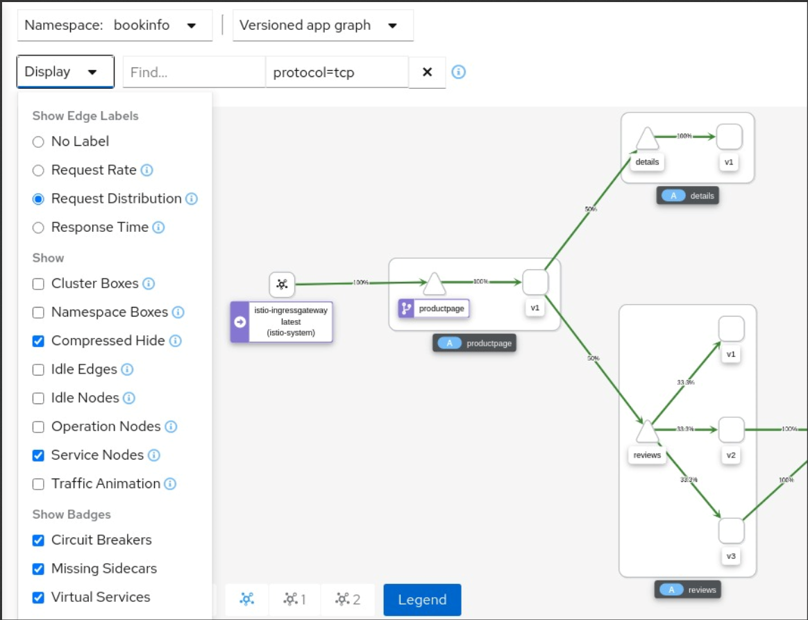

**Arquitetura SAF**
=======

**Objetivo**
------------

Desenhar um modelo Arquitetural moderno, para ajudar na performaçe e resilência da aplicação SAF. Diminuir tempo com troubleshooting e facilitar no desenvolido e evoluções de novas integrações.

High-level design e Low Level Design
----------------

High-level: explica a arquitetura que seria usada para desenvolver um sistema . O diagrama de arquitetura fornece uma visão geral de todo um sistema, identificando os principais componentes que seriam desenvolvidos para o produto e suas interfaces. O HLD pode usar termos não técnicos a levemente técnicos que devem ser compreensíveis para os administradores do sistema. Em contraste, o design de baixo nível expõe ainda mais o design lógico detalhado de cada um desses elementos para uso por engenheiros e programadores . A documentação HLD deve abranger a implementação planejada de software e hardware.

Low level design: serve como base para as descrições do modelo de
integração e tecnologias que serão utilizadas durante a fase de
implementação toda comunicação entre os microserviços são HTTPS e suportado versão 1.2 e 1.3 vTLS.

Desenho arquitetural Kubernetes

Stack tecnológico
-----------------
- 3Scale API management;
- Node.js;
- Sql Server;
- Jaeger;
- fluentd;
- Grafana;
- Prometheus;
- Pub/Sub;

Exemplo Integração SAF - Entrada HTTP/RESTE

Exemplo Integração Pub/Sub - Entrada Pub/Sub

Exemplo Integração Envio de Requisição

-----------------------

##### **Vantagens de usar esse modelo Arquitetural**

1. Escalabilidade nos processos de entrada e saida da arquitetura
2. Tracing de toda a aplicação utilizando o serviço do jaeger.

Exemplos de spam no jaeger:

3. Logging como garantia da requisição para a entrega da requisição
4. Fallback para garantia de entrega da requisição de saída.
5. Componentização dos serviços de entrada é saida.
6. Monitoramento de toda as requisições que entra e sai do mundo Kubernetes.

Exemplos de um dashboard bem legal mostrando quantidade das requisições

Outra coisa bastante legal do mundo kubernetes e se caso a subscrição do openshift existente na globo já tinha instalado uma instância do service mesh. Caso esse serviço esteja disponivel, podemos ter observabilidade, rastreabilidade e logging de toda a aplicação. Segue abaixo o poder da ferramenta kiali para ter toda a observabilidade da aplicação.

##### **Desvantagem de usar esse modelo Arquitetural**

1. Custo para provisionar toda esse ambiente
2. Conhecimento tecnico da equipe.

##### **Planejamento para migração de uma nova arquitetura**

1. Dimensionar custo de hardware do ambiente atual.
  1.1. Estudo de poder computacional atual X Estudo de poder computacional em novo ambiente.
  1.2. Realizar cálculo na calculadora de nuvem para dimensionar o custo computacional no modelo novo de arquitetura

2.  Mapeamento do projeto atual. (Documentação AS IS)
   2.1. Desenho arquitetural mostrando todas as entradas e saidas do ambiente SAF
   2.2. Mapeamento de todos os processos
   2.3. Mapeamento de Inbound e OutBound  do sistema.
   2.4. Estudo de adequação do sistema saf para o novo Modelo.

3. Estudo de Infraestrutura de acesso entrada e saida (Openshift) caso o sistema saf vá para o openshift.   

4. Mapear todo o flow de CI/CD para a nova estrutura, entregando o build da pipeline direto no ACR do Openshift.

5. Mapear quais serviços atuais do sistema SAF, já podem ser migrados para Micro Serviços aproveitando a estrutura nova.

6. Adequar a arquitetura nova depois dos estudos/levantamentos feitos do sistema atual.

7. provisionamento do ambiente openshift.

8. Configuração de serviços do openshift(networking, monitoramento, service mesh)

9. Criação de objetos para o sistema saf(Deployment, configmap, secrets, routes, services)

10. Configuração de flow CI/CD para o openshift.

11. Mapear em fases a deploymento do sistema saf no ambiente openshift.

12. Testes do sistema saf dentro do ambiente openshift.

SQL SERVER, PODE não ser um single point failure. (verificar)

OBS: LEVAR O AS IS PARA O OPENSHIFT
